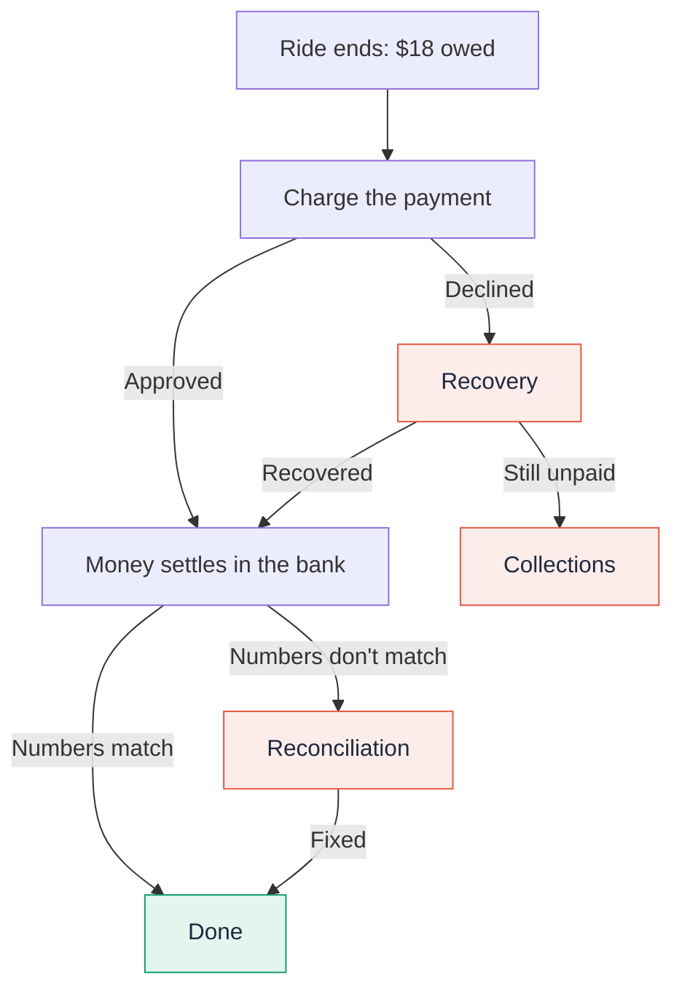
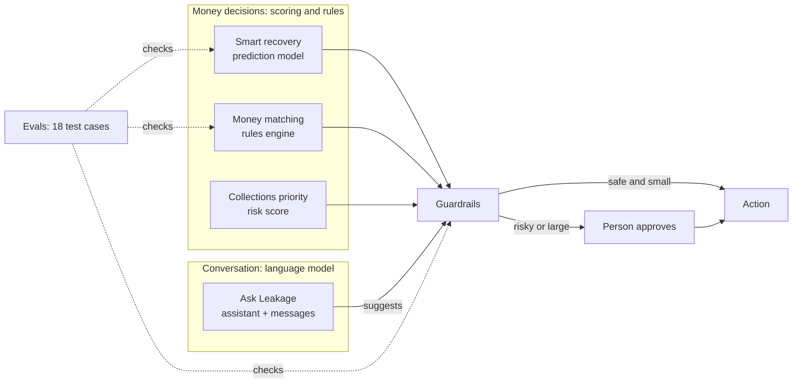
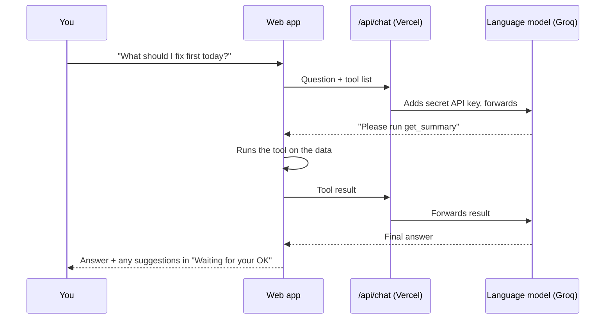
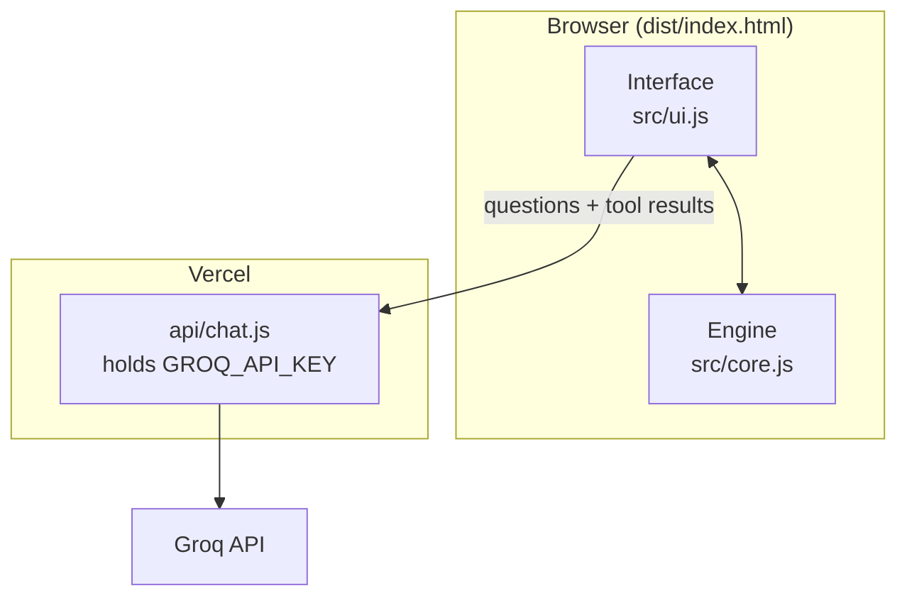

# Leakage

**AI-powered revenue protection for mobility payments.**

🔗 **Live demo: [leakage-ten.vercel.app](https://leakage-ten.vercel.app/)**

Leakage finds money that slips away between "the ride is over" and "the money is in the bank," then gets it back. It recovers failed payments, catches settlement mismatches, and prioritizes collections, with an AI assistant that can investigate and suggest fixes but never moves money without a person's approval.

> **Note:** All data in this project is simulated. Payment methods and flows are modeled on what Tesla shows publicly (Robotaxi app, Tesla wallet, Supercharger kiosks, partner charge cards). Nothing here reflects Tesla internal data.

---

## Overview

Leakage is a revenue-protection layer for pay-after-service businesses such as autonomous ride-hailing and EV charging. It covers the full lifecycle of a payment after authorization:

- **Recovery.** For each declined payment, a scoring policy picks the best sequence of recovery actions (timed retries, backup payment methods, customer outreach) based on the decline reason and customer history, while enforcing card-network retry rules.
- **Reconciliation.** A deterministic matching engine compares the internal ledger against settlement records from each payment provider, classifies every discrepancy into one of six types, and attaches a plain-language explanation and a suggested fix.
- **Collections.** Unrecovered consumer balances and overdue B2B partner invoices are ranked by expected loss. Agents draft outreach; disputes and suspected fraud go to a human.
- **Ops assistant.** A large language model with tool calling answers natural-language questions about the payment data and proposes actions. Every proposal passes through guardrails and a human approval queue.
- **Evals.** A golden test suite verifies the decision logic on every change.

On a simulated week of 10,000 payments, the recovery policy gets back **3.1x** more failed revenue than naive retries, with **zero** card-network rule violations (naive retries: 354).

---

## The problem, in plain words

When you buy a coffee, you pay first and then get the coffee.

With a **Robotaxi ride** or a **Supercharger session**, it's the other way around: you get the service first, and the payment happens afterward. The ride is already over, so if the payment fails, the company has given away something for free unless it gets the money later.

Most of the time everything works: the card is charged, the money arrives, and the numbers match. But at large scale, even a small percentage going wrong adds up to a lot of money. There are three ways it goes wrong:

1. **The payment fails.** The card was declined, expired, or hit a limit, but the rider already got out of the car.
2. **It stays unpaid.** Retries and reminders didn't work. Now it's a debt someone has to follow up on.
3. **The numbers don't match.** The company thinks it charged $18, but the payment provider sent $17.40, $0, or $18 twice.

Every new way to pay (Apple Pay, Google Pay, X Money, charging kiosks, partner charge cards) makes this harder, because each one fails and reports money in its own way.

### Following one payment



The red boxes are where money leaks. Leakage has a part for each one.

---

## What Leakage does

The web app reads top to bottom, like a story:

1. **Overview.** One sentence answers the main question ("This week, $36.2K leaked. Leakage got $18.6K back automatically."), with three cards for the three kinds of leaks.
2. **Follow one payment.** Pick a story (a ride we got paid for, a ride that stayed unpaid, a double charge, a stolen card) and watch it step by step.
3. **Fix issues.** Problems are grouped by cause, like "Not enough money" or "Charged twice." Pick a group, open any case, and see what happened and what to do.
4. **Ask Leakage.** Ask questions in plain English. The assistant looks up the answer and can suggest fixes, which wait in a "Waiting for your OK" panel.
5. **How the AI works.** Explains each AI part, plus the tests and an activity log.

---

## How the AI works, one piece at a time

Each part uses the simplest tool that does the job well. **The language model talks; the money decisions come from scoring, rules, and tests you can check.**



### 1. Smart recovery (a prediction model)

**The problem:** A payment failed after the ride. You could retry now, retry tomorrow, retry on payday, charge a backup card, or message the rider. Which one, and in what order?

**How it works:** Like a good doctor, it looks at the "symptom" first. The symptom is *why* the payment failed:

| Why it failed | What Leakage does |
|---|---|
| Not enough money | The card is fine, the account is empty. Wait for the rider's usual payday, then try once. |
| Bank was briefly down | Try again in an hour. It almost always works. |
| Card expired or invalid | Retrying the same card can never work. Use a backup card or ask the rider to update it. |
| Card lost or stolen | Never touch that card again. Flag it for a fraud check. |

For each option it estimates a chance of success (for example, "payday retry: 58%") and tries the most likely ones first. It also adjusts for the rider: someone who pays on time 95% of the time scores higher than someone at 60%.

**Status:** The chances currently come from a hand-tuned scoring table based on how card payments generally behave. With real data, this would become a trained model (for example, gradient-boosted trees) that learns these numbers from past failures.

**Code:** `recoveryPlan()` in `src/core.js`

### 2. Money matching (rules, not AI, on purpose)

**The problem:** The company's records say "we charged $18." The provider later sends money and says "here's $18." Usually they match. Sometimes they don't.

**How it works:** Like checking your bank statement against your receipts, line by line, for thousands of payments at once:

| Problem | How it's detected | Suggested fix |
|---|---|---|
| Money never arrived | No settlement after 3 days | Ask the provider to trace it |
| Charged twice | Two settlements for one charge | Refund the rider, claim it back |
| Wrong amount | Amounts differ by more than rounding | Check for a fare change, fix the record |
| Tiny rounding | Under 10 cents in a foreign currency | Fixed automatically |
| Extra fees | Fee above the contracted rate | Ask the provider for a credit |
| Money with no charge | Settlement with no matching record | Usually a kiosk session that never synced |

**Why no AI here:** Money records must be exact and give the same answer every time. A language model that is "mostly right" isn't good enough for accounting.

**Code:** `classifyBreaks()` in `src/core.js`

### 3. Collections priority (a risk score)

**The problem:** Some money is still unpaid after every recovery step. Who do you follow up with first?

**How it works:** Every unpaid account gets one score:

```
priority = amount owed × chance it stays unpaid × how late it is
```

Big, risky, old debts go to the top. Two kinds skip the score and go straight to a person: **disputes** ("I never took that ride") and **possible fraud**. You don't want a bot sending payment reminders to a fraud victim.

**Code:** `buildCollections()` in `src/core.js`

### 4. Ask Leakage (the language model)

**What it does:** You ask in plain English ("What should I fix first today?") and it answers using this week's data. It can also rewrite reminder messages so they sound warm and human.

**The key idea is tool calling.** The assistant doesn't get all the data at once. It gets six tools, like buttons it's allowed to press:

- **Five lookup tools:** weekly summary, failed payments, one payment's details, money mismatches, unpaid accounts
- **One suggest tool:** propose an action for a person to approve



The assistant can **look** but can't **touch** money. Its only way to act is the suggest tool, and every suggestion goes through the guardrails and then waits for a person.

**Which model:** Inside Claude, the page uses Claude through the viewer's own account. On the public website, it uses an open model on Groq through a small Vercel function that keeps the API key secret on the server. It tries `openai/gpt-oss-120b` first and falls back to other models if one is unavailable.

**Code:** `TOOLS` and `ask()` in `src/ui.js`, plus `api/chat.js`

### 5. Guardrails and approval (the safety layer)

**The problem:** Stopping anyone, whether a bug, an agent, or the AI assistant, from doing something dangerous with money.

**How it works:** Like a bank teller who can hand out small amounts but needs a manager's signature for big ones. Every action is checked against fixed rules:

- Never retry an expired, invalid, or stolen card (card networks penalize this)
- At most 3 attempts per payment
- Refunds over **$100** need a person
- Write-offs over **$25** need a person
- Messages about disputed charges go through a person

**Try it:** Ask the assistant to *"Retry the biggest payment from a stolen card."* The rule blocks it, and the assistant explains why.

**Code:** `checkAction()` in `src/core.js`

### 6. Evals (tests for the decision logic)

**The problem:** Proving the system makes the right decisions, and keeps making them after every change.

**How it works:** Like an exam with an answer key, there are 18 tricky situations with known right answers, for example:

- Expired card with no backup → must ask the rider, never retry
- A €0.03 difference → rounding, fix automatically
- A €4.00 difference → not rounding, a real problem
- A $640 refund → needs human approval

| | Passes |
|---|---|
| Leakage | **18 of 18** |
| Plain "retry 3 times" | 1 of 7 payment cases |

**Code:** `runEvals()` in `src/core.js` and `tests/core.test.js`

---

## Results on simulated data

One simulated week, 10,000 payments across 7 payment methods and 6 markets:

| Metric | Leakage | Plain retries |
|---|---|---|
| Failed revenue recovered | **$18.6K of $27.7K** | $6.0K |
| Card-network rule violations | **0** | 354 |
| Settlement mismatches found | 286, each explained | none |
| Eval cases passed | **18 / 18** | 1 / 7 |

Every injected settlement mismatch is detected with no false alarms (verified by the test suite).

---

## Architecture



All payment data is generated and processed in the browser. The server function only relays assistant messages to the model and keeps the API key secret.

## Project layout

```
src/core.js         Engine: simulated data, recovery, reconciliation, collections, guardrails, evals
src/index.html      Page layout and styles
src/ui.js           Interface and the AI assistant
api/chat.js         Vercel function that calls Groq with the secret key
tests/              Automated tests (node --test)
build.js            Bundles everything into dist/index.html
vercel.json         Vercel build settings
```

## Run it locally

Requires Node.js 18 or newer.

```bash
npm test          # run the tests
npm run build     # build dist/index.html
```

Open `dist/index.html` in a browser. Everything works except the assistant, which needs the Vercel function.

## Deploy on Vercel

1. Import this repository into Vercel. The build settings come from `vercel.json`.
2. In **Settings → Environment Variables**, add `GROQ_API_KEY` with a key from [console.groq.com](https://console.groq.com).
3. Optional: add `GROQ_MODEL` to choose a specific model.
4. Redeploy.

Never commit the API key to the repository.

## What I would do with real data

1. Train the recovery model on historical declines and measure the lift with an A/B holdout.
2. Connect reconciliation to real settlement files from each payment provider.
3. Build an evaluation set for the assistant's answers, not only the decision logic.
4. Add support for new payment methods as they launch, with their own decline codes and settlement formats.

---

*Built as a prototype to explore how AI can protect revenue in pay-after-service mobility payments.*
